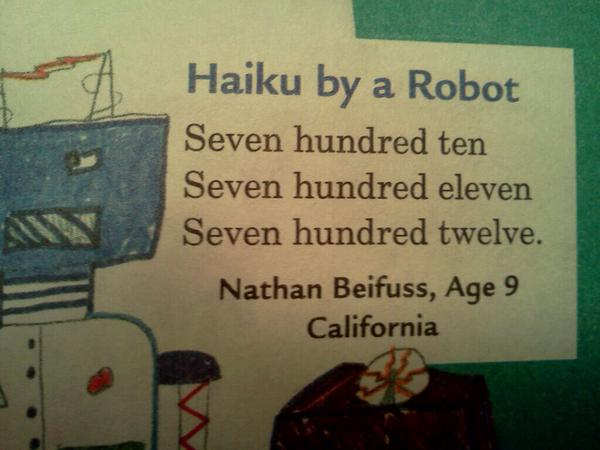

Robot Poems
===========

Happening upon the above picture on Imgur got me thinking about the kind of
poetry that robots would actually write. A computer fundamentally "thinks" in
ones and zeroes, and would require lots of extra code and heuristics to figure
out the syllable counts of decimal numbers. 

However, "one" is one syllable and "zero" is two, so by combining arbitrary
numbers of those digits, we can get a line of any syllable length we want. 

There's a whole branch of mathematics, combinatorics, which discusses the
different ways in which we could combine "one" and "zero" to get a line of a
particular number of syllables. 

Haiku
-----

A `haiku <http://en.wikipedia.org/wiki/Haiku#Syllables_or_on_in_haiku>`_ is of
the form 5, 7, 5, and it doesn't matter what syllables the stress falls on. 

Limerick
--------

`syllable position and emphasis rules
<http://whvvugt.home.xs4all.nl/Archives_TCCMB/Limericks/Structure.html>`_

    Writing a Limerick's absurd,
    Line one and line five rhyme in word,
      And just as you've reckoned
      They rhyme with the second;
    The fourth line must rhyme with the third.

(author unspecified, found `here http://en.wikipedia.org/wiki/Limerick_%28poetry%29`_)

